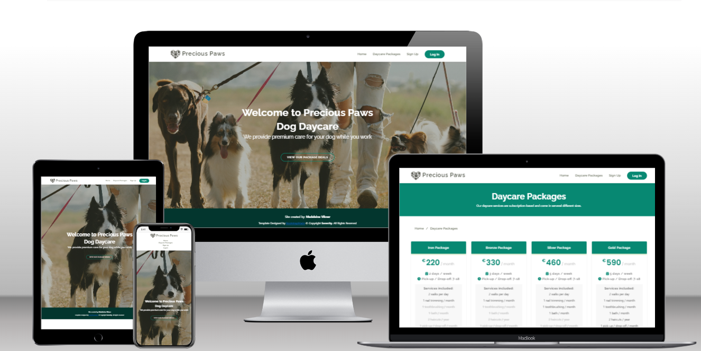
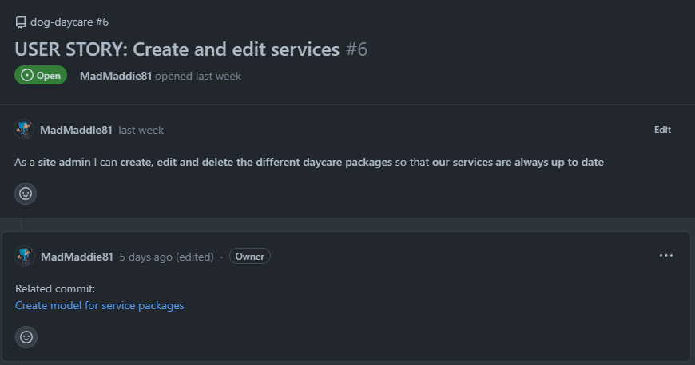

# Precious Paws

Precious Paws is a fictional dog daycare company that could be located anywhere in Europe.  
The app has been designed primarily to handle applications for the daycare services.

---

# Design & User Experience

## Site Goals
* Administrive staff can add, edit and delete the service packages the daycare offers.
* The user can sign up for an account to apply for services.
* The logged in user can apply for daycare services, and after submission the application can be edited and/or deleted.
* Administrive staff can change the application status from "Pending" to "Approved" or "Declined".
* The user can see the status of their application when logged in.

## Agile Planning
The project was planned out using GitHub's Projects and User Stories.  
See the project [__HERE__](https://github.com/users/MadMaddie81/projects/2/views/1)  
The app was built in the steps described in Site Goals, and each user story has been followed up with a link to the commit where the feature was implemented.  
During the development process each feature has been manually tested, on it's own as well as in relation to the other features.  

