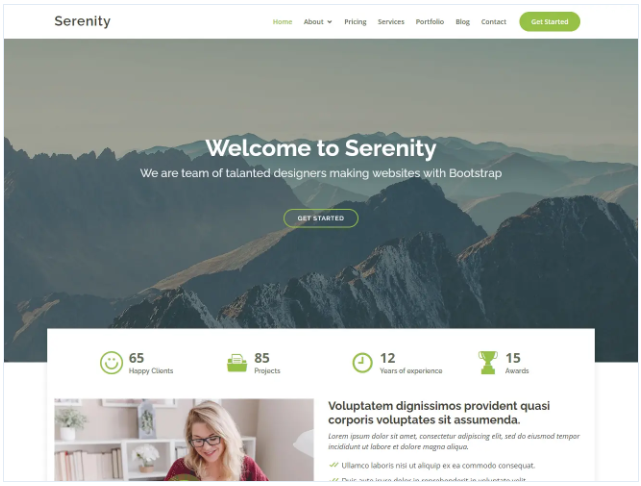

# __Precious Paws__

Precious Paws is a fictional dog daycare company that could be located anywhere in Europe.  
The app has been designed primarily to handle applications for the daycare services.

Visit the deployed site [__HERE__](https://precious-paws.herokuapp.com/)

---

# __Design & User Experience__

## __Site Goals__
* Administrive staff can add, edit and delete the service packages the daycare offers.
* The user can sign up for an account to apply for services.
* The logged in user can apply for daycare services, and after submission the application can be edited and/or deleted.
* Administrive staff can change the application status from "Pending" to "Approved" or "Declined".
* The user can see the status of their application when logged in.

## __Agile Planning__
The project was planned out using GitHub's Projects and User Stories.  
See the project [__HERE__](https://github.com/users/MadMaddie81/projects/2/views/1)  
The app was built in the steps described in Site Goals, and each user story has been followed up with a link to the commit where the feature was implemented.  
During the development process each feature has been manually tested, on it's own as well as in relation to the other features.  

## __Features__

### __Layout__
For this project I decided to work with a pre-made Bootstrap template that I customised to fit my site.  
Mostly because I haven't used one before and I was curious about the benefits and challenges that comes with using styling created by someone else.  
My own additions can be found at the bottom of the template static.css file.

> The template used is called Serenity and was created by [__BootstrapMade__](https://bootstrapmade.com/serenity-bootstrap-corporate-template/)  
> 

### __Header, Navigation & Footer__
* The header is intentionally very simplistic and scaled back.
* The navigation bar contains links to the landing page, the daycare packages offered, signup, login/logout, and if a user is signed in a link to submitted applications.
* The footer is simply an acnowlagement of the site creator and the copyright information for the Bootstrap template.
* The header and footer follow the user along all pages of the site.

__Issue:__ The intention was to have a drop down navbar on mobile devices, but I found it hard to get the template JS file to cooperate with my code.  
After struggling with it for far too long I decided to fall back on a static navbar for mobile, since the navigaion links provided isn't that many.  

### __The Landing Page__
* The hero image on the landing page is a stock photo of daycare dogs taking a walk.
* The text and the link on the page has a stylish fade-up effect when entering the page.

### __Daycare Packages__
* This page presents the user with the different daycare subscribtion deals offered.
* The packages and their content can be edited by a user with superuser status through the [__admin pages__](https://precious-paws.herokuapp.com/admin/)

### __Applying for daycare__
* When the user has found a package that is suitable for them and their dog they can apply for a spot in the daycare
* After the form has been submitted the user can view it on the "My Applications" page.
* The top of the application shows its status. This status can only be changed by the daycare staff through the admin pages.
* The user is free to edit or recind their application at any time.

### __Features yet to be implemented__
* The site is still very generic. Features that could be added would be the specific info about the daycare, such as an about page, conditions for an application to be approved, and contact info.
* The authentication system is very simple and could be improved on.

---

## __Technologies__

* HTML
  - The structure of the Website was developed using HTML as the main language.
* CSS
  - The Website was styled using custom CSS in an external file.
* JavaScript
  - JavaScript was used very sparingly to display messages and things like that.
* Python
  - Python was the main programming language used for the application using the Django Framework.
* Bootstrap
  - Additional styling were implemented with Bootstrap classes.
* GitPod
  - The website was developed in the GitPod editor.
* GitHub
  - Source code is hosted on GitHub
* Git
  - Used to commit and push code during the development of the Website
* Font Awesome
  - This was used for various icons throughout the site
* Favicon.io
  - Favicon files were created at [Favicon.io](https://favicon.io/favicon-converter/)

### __External Python modules used__
* cloudinary-storage
* crispy-forms
* dj-database-url
* Django
* gunicorn
* allauth

## __Heroku Deployment__

The site was deployed to Heroku. The steps to deploy are as follows:

* Navigate to heroku and create an account
* Click the new button in the top right corner
* Select create new app
* Enter app name
* Select region and click create app
* When the app has been created, go to the settings tab and then click reveal config vars
* Add the following config vars:
  - SECRET_KEY: (Your secret key)
  - DATABASE_URL: (Address to your postgres database)
  - PORT: 8000
  - CLOUNDINARY_URL: (cloudinary api url)
* Click the deploy tab
* Scroll down to Connect to GitHub and sign in / authorize when prompted
* In the search box, find the repositoy you want to deploy and click connect
* Scroll down to Manual deploy and choose the main branch
* Click deploy

The app should now be deployed.

The live link can be found [__HERE__](https://precious-paws.herokuapp.com/)

---

## __Testing__

### __Accessibility and Validator Testing__
* The site looks as intended on all screen sizes from 320px and up
* The site was run through the [w3 HTML Validator](https://validator.w3.org/)
* [Wave Accessibility](https://wave.webaim.org/) tool was used for aid accessibility testing.
  - A few contrast warnings, but no outright errors
* [CI Python Linter](https://pep8ci.herokuapp.com/) was used to test all Python code. A few PEP8 warnings due to long lines, that couldn't be helped, otherwise no problems

__Lighthouse audits__  

### __Functional Testing__
All functional testing can be found in this [Google Document](https://docs.google.com/document/d/1MkA9Myi5n2Sp7LZy6Be0jQj2SSpBzMNy7MErUsKeqYI/edit?usp=sharing)

---

## __Credits__

* The Bootstrap template was provided by [__BootstrapMade__](https://bootstrapmade.com/serenity-bootstrap-corporate-template/)
* Images are free stock photos and clipart
